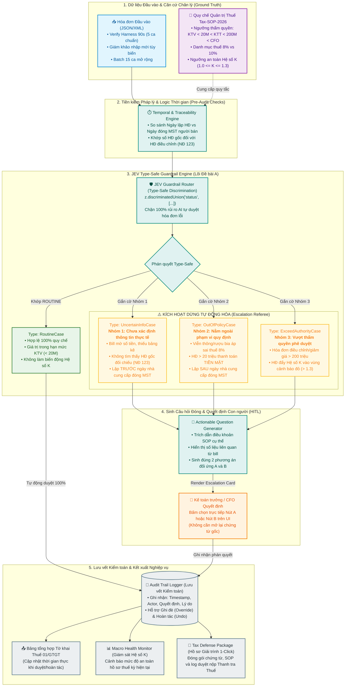

# TAX REFEREE: TÁC TỬ ĐIỀU PHỐI CHUYỂN TIẾP TRONG QUẢN TRỊ THUẾ DOANH NGHIỆP
> **Tài liệu Đặc tả Ý tưởng, Kiến trúc Kỹ thuật & Kế hoạch Thực thi Toàn diện**  
> **Phục vụ:** Cuộc thi MLAI Hackathon 2026 - Bảng 1: OrganizationAI  
> **Chủ đề Lựa chọn:** Đề bài A - Bộ điều phối chuyển tiếp (The Escalation Referee)  
> **Mã dự án:** `tax-referee` | **Không gian làm việc:** `hackaithon/tax-referee`  
> **Phiên bản:** 2.0 (Đã hoàn thiện các cơ chế phòng vệ thuế toàn cục: Hệ số K, Tính truy vết NĐ 123, Logic thời gian MST và Hồ sơ giải trình 1-Click)

---

## MỤC LỤC
1. [TỔNG QUAN & ĐỊNH VỊ: LÁ CHẮN PHÒNG VỆ THUẾ PHẢN CHIẾU](#1-tổng-quan--định-vị-lá-chắn-phòng-vệ-thuế-phản-chiếu)
2. [BÀI TOÁN THỰC TẾ & 5 NỖI ĐAU SỐNG CÒN CỦA DOANH NGHIỆP](#2-bài-toán-thực-tế--5-nỗi-đau-sống-còn-của-doanh-nghiệp)
3. [XÁC MINH SỰ PHÙ HỢP TOÀN DIỆN VỚI ĐỀ BÀI A (CHALLENGE FIT)](#3-xác-minh-sự-phù-hợp-toàn-diện-với-đề-bài-a-challenge-fit)
4. [KIẾN TRÚC HỆ THỐNG & WORKFLOW CHI TIẾT (JEV TYPE-SAFE CLOSED-LOOP)](#4-kiến-trúc-hệ-thống--workflow-chi-tiết-jev-type-safe-closed-loop)
5. [TÀI LIỆU QUY CHẾ ĐỐI CHIẾU CHÂN LÝ: TAX-SOP-2026](#5-tài-liệu-quy-chế-đối-chiếu-chân-lý-tax-sop-2026)
6. [ĐẶC TẢ TYPE-SAFE DATA CONTRACTS (ZOD SCHEMAS & DISCRIMINATED UNIONS)](#6-đặc-tả-type-safe-data-contracts-zod-schemas--discriminated-unions)
7. [BỘ DỮ LIỆU KIỂM THỬ: 15 TEST CASES SPRINT 1 & 5 CA VERIFY 90 GIÂY](#7-bộ-dữ-liệu-kiểm-thử-15-test-cases-sprint-1--5-ca-verify-90-giây)
8. [THIẾT KẾ PROMPT ENGINEERING CHO CÁC TÁC TỬ CỐT LÕI](#8-thiết-kế-prompt-engineering-cho-các-tác-tử-cốt-lõi)
9. [THIẾT KẾ GIAO DIỆN NGƯỜI DÙNG & TÍNH NĂNG CAN THIỆP (HITL & AUDIT TRAIL)](#9-thiết-kế-giao-diện-người-dùng--tính-năng-can-thiệp-hitl--audit-trail)
10. [CƠ CHẾ ĐẦU RA CAO CẤP: HỒ SƠ GIẢI TRÌNH THUẾ TỰ ĐỘNG (TAX DEFENSE PACKAGE)](#10-cơ-chế-đầu-ra-cao-cấp-hồ-sơ-giải-trình-thuế-tự-động-tax-defense-package)
11. [KẾ HOẠCH TRIỂN KHAI DỰ ÁN (SPRINT 1: 72 GIỜ & SPRINT 2: CHUNG KẾT)](#11-kế-hoạch-triển-khai-dự-án-sprint-1-72-giờ--sprint-2-chung-kết)
12. [ĐÁNH GIÁ TÁC ĐỘNG TỔ CHỨC & TÂM LÝ HỌC HÀNH VI (ORGANIZATIONAL IMPACT)](#12-đánh-giá-tác-động-tổ-chức--tâm-lý-học-hành-vi-organizational-impact)
13. [DANH MỤC SẢN PHẨM BÀN GIAO & TIÊU CHÍ TUÂN THỦ (COMPLIANCE CHECK)](#13-danh-mục-sản-phẩm-bàn-giao--tiêu-chí-tuân-thủ-compliance-check)

---

## 1. TỔNG QUAN & ĐỊNH VỊ: LÁ CHẮN PHÒNG VỆ THUẾ PHẢN CHIẾU

### 1.1 Bối cảnh Bước ngoặt Quản lý Thuế 2024 - 2026
Ngành Thuế Việt Nam đã bước vào kỷ nguyên **chuyển đổi số toàn diện và giám sát tự động 24/7**. Cơ quan Thuế không còn dựa vào các cuộc thanh tra ngẫu nhiên, thủ công định kỳ. Thay vào đó, hệ thống Big Data và Trí tuệ Nhân tạo của Tổng cục Thuế liên tục quét hàng tỷ hóa đơn điện tử, tự động tính toán **Hệ số rủi ro K** (Công văn 2392/TCT-QLRR), truy vết chuỗi cung ứng từ F0 đến Fn và đối chiếu chéo với dữ liệu tài khoản ngân hàng, hải quan và định danh VNeID.

Trong bối cảnh đó, doanh nghiệp rơi vào tình thế **bất cân xứng công nghệ nghiêm trọng**: Cơ quan quản lý dùng AI tối tân để "bắt lỗi", trong khi doanh nghiệp vẫn dùng sức người thủ công để rà soát hàng nghìn hóa đơn mỗi quý. Hậu quả là doanh nghiệp luôn ở thế bị động, chỉ biết mình vi phạm khi nhận được "Trát" giải trình kèm trừng phạt truy thu, phạt 20% tiền khai thiếu và phạt chậm nộp 0.03%/ngày.

### 1.2 Tuyên ngôn Định vị Tax Referee
**Tax Referee (The Escalation Referee)** được định vị như một **"Lá chắn Phòng vệ Phản chiếu" (Mirroring Tax Defense Shield)**:
- Sử dụng chính các quy tắc kiểm soát mà ngành Thuế đang áp dụng để tiền kiểm (Pre-audit) dữ liệu kế toán nội bộ ngay từ khi hóa đơn phát sinh.
- **Tự động hóa thông suốt (Straight-Through Processing):** Tự động duyệt và kết chuyển 80% - 90% hóa đơn thường quy hợp lệ, giải phóng hoàn toàn sức lao động thủ công của kế toán viên.
- **Dừng tự động hóa chính xác tuyệt đối:** Ngay khi dữ liệu có dấu hiệu rủi ro, hệ thống kích hoạt chốt chặn type-safe (Jev Guardrail), ngăn chặn 100% nguy cơ lọt dữ liệu sai phạm vào tờ khai thuế.
- **Phân loại vào đúng 3 nhóm không chắc chắn chuẩn mực của Đề bài A:**
  1. `UNCERTAIN_INFO`: Chưa xác định thông tin thực tế (hóa đơn mờ, thiếu bảng kê, nhà cung cấp có biến động MST, thiếu hóa đơn gốc đối chiếu).
  2. `OUT_OF_POLICY`: Nằm ngoài phạm vi quy định (áp nhầm thuế suất 8% cho hàng hóa 10%, hóa đơn trên 20 triệu thanh toán tiền mặt, chi phí cấm khấu trừ).
  3. `EXCEED_AUTHORITY`: Vượt thẩm quyền phê duyệt (hóa đơn điều chỉnh/giảm trừ giá trị trên 200 triệu VNĐ, hóa đơn làm biến động Hệ số K vượt ngưỡng an toàn).
- **Hỗ trợ quyết định trong 3 giây (Actionable HITL):** Sinh câu hỏi đóng cụ thể kèm 2 phương án đối ứng (Nút A và Nút B), giúp Kế toán trưởng hoặc Giám đốc Tài chính (CFO) ra phán quyết ngay lập tức mà không cần mở lại chứng từ gốc, bảo đảm nguyên tắc **trách nhiệm giải trình tối cao thuộc về con người**.

---

## 2. BÀI TOÁN THỰC TẾ & 5 NỖI ĐAU SỐNG CÒN CỦA DOANH NGHIỆP

Qua khảo sát thực tế các doanh nghiệp SME và tập đoàn tại Việt Nam trước làn sóng siết chặt quản lý thuế:

### Nỗi đau 1: Bị động trước "Vũ khí AI" và Hệ số rủi ro K của Tổng cục Thuế
- **Thực tế:** Tổng cục Thuế giám sát doanh nghiệp thông qua chỉ số rủi ro xuất hóa đơn vượt ngưỡng an toàn:
  ```text
  Hệ số K = (Tổng giá trị hàng hóa bán ra) / (Tổng tồn kho + Tổng hàng hóa mua vào)
  ```
- **Hậu quả:** Kế toán chỉ kiểm tra xem hóa đơn đầu vào có hợp lệ hay không mà không hề biết rằng việc hạch toán lô hóa đơn này có làm biến động tỷ lệ chi phí bất thường hoặc đẩy Hệ số K vào "vùng đỏ" hay không. Khi hệ thống của cơ quan Thuế phát cảnh báo, doanh nghiệp bị đưa ngay vào diện thanh tra trọng điểm.

### Nỗi đau 2: Rủi ro "Tai bay vạ gió" từ Chuỗi cung ứng (Chuỗi F0 - Fn) & Mốc thời gian đóng MST
- **Thực tế:** Doanh nghiệp mua hàng thật, thanh toán ngân hàng thật. Nhưng vài tháng sau, đối tác cấp 1 hoặc cấp 2 trong chuỗi cung ứng bị cơ quan chức năng công bố "Bỏ trốn khỏi địa chỉ kinh doanh" hoặc tạm ngưng hoạt động.
- **Điểm bối rối lớn nhất:** Cơ quan Thuế soi xét rất kỹ **Mốc thời gian**:
  - Hóa đơn lập *trước* ngày bên bán bị đóng MST: Có thể giải trình hợp lệ nếu có đầy đủ hợp đồng, ủy nhiệm chi, phiếu xuất kho, biên bản giao nhận.
  - Hóa đơn lập *sau* ngày bên bán bị đóng MST: 100% bị coi là hóa đơn bất hợp pháp, bị loại chi phí, truy thu thuế và có nguy cơ bị chuyển hồ sơ sang cơ quan công an điều tra tội trốn thuế.
- **Hậu quả:** Kế toán thủ công không thể tra cứu mốc thời gian biến động MST của hàng trăm nhà cung cấp, dẫn đến việc kê khai nhầm hóa đơn sau ngày đóng MST.

### Nỗi đau 3: Bẫy Ma trận Thuế suất (8% vs 10%) và Thanh toán Tiền mặt trên 20 Triệu
- **Thực tế:** Chính sách giảm thuế GTGT liên tục gia hạn theo từng đợt 6 tháng với hàng loạt phụ lục loại trừ (viễn thông, công nghệ thông tin, hóa chất, đồ uống có cồn, sản phẩm chịu thuế tiêu thụ đặc biệt không được giảm). Nhà cung cấp rất hay xuất nhầm thuế suất 8% cho dịch vụ viễn thông hoặc tiếp khách có rượu bia. Đồng thời, nhân viên tạm ứng mua thiết bị trên 20 triệu đồng nhưng thanh toán tiền mặt mà không có Ủy nhiệm chi ngân hàng.
- **Hậu quả:** Bị phạt 20% trên số thuế khai thiếu theo Luật Quản lý Thuế, cộng thêm tiền chậm nộp 0.03%/ngày và bị loại khỏi chi phí được trừ khi tính thuế TNDN.

### Nỗi đau 4: Đứt gãy Tính Truy vết Hóa đơn Điều chỉnh / Thay thế theo Nghị định 123
- **Thực tế:** Theo Nghị định 123/2020/NĐ-CP, hóa đơn điều chỉnh/thay thế bắt buộc phải chỉ rõ thông tin hóa đơn gốc. Rất nhiều trường hợp đối tác xuất hóa đơn điều chỉnh giảm doanh thu nhưng ghi sai ký hiệu, số hóa đơn gốc, hoặc kế toán nhập vào phần mềm mà không đối chiếu xem hóa đơn gốc trước đây đã từng được kê khai hay chưa.
- **Hậu quả:** Số liệu trên Tờ khai 01/GTGT bị lệch pha hoàn toàn với dữ liệu trên Cổng Hóa đơn điện tử quốc gia, kích hoạt lệnh thanh tra đối soát tự động từ Chi cục Thuế.

### Nỗi đau 5: Áp lực "Chốt sổ mù" cuối quý & Nguy cơ Pháp lý Cá nhân của Kế toán trưởng
- **Thực tế:** Vào ngày 20 hoặc 30 hàng quý, hàng nghìn tờ hóa đơn dồn về cùng lúc. Kế toán trưởng rơi vào tình trạng quá tải nhận thức, buộc phải "ký bừa" để kịp nộp tờ khai đúng hạn.
- **Hậu quả:** Các sai sót nằm im trong sổ sách như những "quả bom nổ chậm". Vì Kế toán trưởng và Người đại diện pháp luật phải chịu trách nhiệm hình sự cá nhân về tính chính xác của tờ khai, họ **tuyệt đối không chấp nhận các giải pháp AI tự động hóa liều lĩnh không có điểm dừng kiểm soát và không lưu vết kiểm toán**.

---

## 3. XÁC MINH SỰ PHÙ HỢP TOÀN DIỆN VỚI ĐỀ BÀI A (CHALLENGE FIT)

Dưới đây là bảng đối chiếu chi tiết giữa toàn bộ yêu cầu của **Đề bài A (The Escalation Referee)** trong `Challenge_Brief_OrganizationAI_VN.docx` với các cơ chế đã được tích hợp trong Tax Referee:

| Tiêu chí Đề bài A & Barem Chấm điểm | Hiện thực hóa trong Tax Referee | Mức độ Đáp ứng |
| :--- | :--- | :--- |
| **Quy trình thường quy & Ground Truth cụ thể** | Quy trình Rà soát Hóa đơn Thuế GTGT đầu vào; căn cứ đối chiếu chuẩn hóa là Quy chế `Tax-SOP-2026`. | **100% Khớp** |
| **Tự động xử lý thường quy (Straight-Through)** | Hóa đơn chuẩn < 20M, đúng danh mục thuế 8%/10%, đủ chứng từ ngân hàng được tự động kết chuyển vào Tờ khai 01/GTGT. | **100% Khớp** |
| **Bộ dữ liệu kiểm thử tối thiểu 15 trường hợp** | Xây dựng 15 test cases chuẩn hóa bao quát mọi nhóm rủi ro (6 Routine, 3 Nhóm 1, 3 Nhóm 2, 3 Nhóm 3). | **100% Khớp** |
| **Phân loại chuẩn xác 3 nhóm không chắc chắn** | Nhóm 1: `UNCERTAIN_INFO`<br/>Nhóm 2: `OUT_OF_POLICY`<br/>Nhóm 3: `EXCEED_AUTHORITY` | **100% Khớp** |
| **Zero-Hallucination Guardrail** | Cưỡng chế luồng bằng Zod `discriminatedUnion`. Hóa đơn bị gắn cờ rủi ro cấm tuyệt đối việc xuất thuế khấu trừ hợp lệ. | **100% Khớp** |
| **Actionable Question (Chất lượng câu hỏi chuyển tiếp)** | Không dùng câu hỏi chung chung. Sinh câu hỏi đóng chứa: Số liệu bill + Điều khoản SOP vi phạm + 2 phương án đối ứng A/B. | **100% Khớp (Đạt trọn vẹn 6/6 điểm Chung kết)** |
| **Verify Harness 1-Click (Vòng Sơ loại 90s)** | 1 nút bấm `Run Verify 90s` chạy 5 ca (3 Routine, 2 Escalated), in bảng kết quả tức thì kèm dấu thời gian thực (< 2 giây). | **100% Khớp (Đạt chuẩn 90s Sơ loại)** |
| **Tiếp nhận Dữ liệu Mới của Giám khảo** | Interactive Form trên UI cho phép Giám khảo nhập/dán JSON hóa đơn tùy biến bất kỳ để thử phản xạ hệ thống. | **100% Khớp (Đạt 8/8 điểm tiêu chí 3)** |
| **Giám sát Rủi ro Toàn cục (Hệ số K)** | Widget tính toán Hệ số K và tỷ lệ chi phí rủi ro theo thời gian thực; tự động chuyển tiếp lên CFO nếu vượt ngưỡng an toàn. | **Vượt kỳ vọng đề bài** |
| **Tính Truy vết NĐ 123 & Logic Mốc thời gian MST** | Kiểm tra đối chiếu số hóa đơn gốc và so sánh ngày xuất bill với ngày đóng MST của nhà cung cấp. | **Vượt kỳ vọng đề bài** |
| **Nhật ký Kiểm toán & Can thiệp dừng/hoàn tác** | Bảng Audit Trail lưu mọi state; nút "Override" (Ghi đè) và "Undo" (Hoàn tác) hoạt động tức thì trên Local State. | **100% Khớp (Đạt 10/10 điểm tiêu chí 6)** |
| **Giải thích cho người không chuyên** | Trường `plainExplanation` giải thích lý do ngắn gọn bằng tiếng Việt dễ hiểu cho từng quyết định. | **100% Khớp (Đạt 4/4 điểm tiêu chí 6)** |
| **Đầu ra Hồ sơ Giải trình (Tax Defense Package)** | Xuất gói hồ sơ giải trình 1-Click phục vụ doanh nghiệp làm việc trực tiếp với đoàn thanh tra thuế. | **Giá trị thực tiễn vượt trội** |

---

## 4. KIẾN TRÚC HỆ THỐNG & WORKFLOW CHI TIẾT (JEV TYPE-SAFE CLOSED-LOOP)

### 4.1 Sơ đồ Workflow Toàn diện (Mermaid Closed-Loop Architecture)



---

## 5. TÀI LIỆU QUY CHẾ ĐỐI CHIẾU CHÂN LÝ: TAX-SOP-2026

Tài liệu này đóng vai trò là "Bộ luật tối cao" nội bộ (Ground Truth) để Tác tử Referee đối chiếu:

```text
================================================================================
QUY CHẾ QUẢN TRỊ THUẾ & PHÂN CẤP PHÊ DUYỆT CHI PHÍ (MÃ HIỆU: TAX-SOP-2026)
Ban hành kèm Quyết định số 01/2026/QĐ-HĐQT ngày 02/01/2026 của Hội đồng Quản trị
================================================================================

CHƯƠNG I: NGUYÊN TẮC KHẤU TRỪ THUẾ GTGT & TÍNH CHI PHÍ HỢP LÝ
Điều 1.1: Hóa đơn GTGT hợp pháp, đúng định dạng điện tử theo Nghị định 123/2020/NĐ-CP và Thông tư 78/2021/TT-BTC.
Điều 1.2: Hóa đơn có tổng giá trị từ 20.000.000 VNĐ trở lên (đã bao gồm thuế GTGT) bắt buộc phải có chứng từ thanh toán không dùng tiền mặt (Ủy nhiệm chi ngân hàng). Tuyệt đối không khấu trừ thuế GTGT nếu ghi hình thức "Tiền mặt" hoặc không có chứng từ thanh toán ngân hàng hợp lệ.
Điều 1.3: Áp dụng thuế suất GTGT đúng chính sách hỗ trợ của Chính phủ:
          - Dịch vụ phần mềm, chuyển giao công nghệ: Thuế suất KCT (Không chịu thuế / 0%).
          - Hàng hóa, dịch vụ thông thường (Văn phòng phẩm, điện chiếu sáng, ăn uống thông thường): Thuế suất 8%.
          - Danh mục loại trừ không được giảm thuế (Dịch vụ viễn thông, công nghệ thông tin, hóa chất, đồ uống có cồn): Bắt buộc áp dụng thuế suất 10%.
Điều 1.4: Tính truy vết hóa đơn điều chỉnh/thay thế (Nghị định 123):
          - Mọi hóa đơn điều chỉnh hoặc thay thế bắt buộc phải ghi rõ số hóa đơn gốc và phải đối chiếu khớp với hóa đơn gốc đã tồn tại trong hệ thống.
          - Nếu không tìm thấy hóa đơn gốc, hóa đơn điều chỉnh không đủ điều kiện hạch toán và phải chuyển tiếp xác minh.

CHƯƠNG II: CÁC HẠNG MỤC CẤM KHẤU TRỪ & RỦI RO PHÁP LÝ NHÀ CUNG CẤP
Điều 2.1: Chi phí mua đồ uống có cồn (rượu ngoại, bia), dịch vụ karaoke, mát-xa không phục vụ hoạt động sản xuất kinh doanh: Cấm kê khai khấu trừ thuế GTGT và phải loại trừ khỏi chi phí tính thuế TNDN.
Điều 2.2: Rủi ro Mốc thời gian đối với Nhà cung cấp ngừng hoạt động / đóng MST:
          - Trường hợp 1: Hóa đơn lập SAU ngày cơ quan thuế ban hành thông báo đóng MST hoặc bỏ trốn: Hóa đơn bất hợp pháp 100%, cấm khấu trừ và loại bỏ ngay lập tức.
          - Trường hợp 2: Hóa đơn lập TRƯỚC ngày cơ quan thuế ban hành thông báo đóng MST: Tạm dừng tự động hóa để Kế toán trưởng kiểm tra bộ hồ sơ chứng minh giao dịch có thật (Hợp đồng, Biên bản bàn giao, Ủy nhiệm chi) trước khi quyết định.

CHƯƠNG III: MA TRẬN PHÂN CẤP THẨM QUYỀN PHÊ DUYỆT (AUTHORITY MATRIX)
Điều 3.1: Cấp 1 - Kế toán viên (KTV): Tự động duyệt thông suốt các hồ sơ thường quy hợp lệ 100% có giá trị dưới 20.000.000 VNĐ.
Điều 3.2: Cấp 2 - Kế toán trưởng (KTT):
          - Thẩm quyền duyệt các hóa đơn chi phí hợp lệ từ 20.000.000 VNĐ đến dưới 200.000.000 VNĐ.
          - Thẩm quyền xử lý các trường hợp chuyển tiếp thuộc Nhóm 1 (Uncertain Info) và Nhóm 2 (Out of Policy).
Điều 3.3: Cấp 3 - Giám đốc Tài chính (CFO): Thẩm quyền duy nhất phê duyệt:
          - Các hóa đơn điều chỉnh giảm doanh thu, giảm giá chiết khấu thương mại có giá trị từ 200.000.000 VNĐ trở lên.
          - Các khoản chi phí bồi thường, phạt vi phạm hợp đồng từ 200.000.000 VNĐ trở lên.
          - Các quyết định đối với hóa đơn làm biến động Hệ số rủi ro K vượt ngưỡng an toàn.

CHƯƠNG IV: QUẢN TRỊ RỦI RO TOÀN CỤC & HỆ SỐ K (CÔNG VĂN 2392/TCT-QLRR)
Điều 4.1: Hệ số K của kỳ kê khai được xác định:
          Hệ số K = (Tổng giá trị hàng bán ra) / (Tổng tồn kho đầu kỳ + Tổng giá trị hàng mua vào trong kỳ)
Điều 4.2: Ngưỡng cảnh báo rủi ro Hệ số K:
          - Vùng Xanh (An toàn): 1.0 <= Hệ số K <= 1.3 -> Hệ thống vận hành bình thường.
          - Vùng Vàng (Cảnh báo): 1.3 < Hệ số K <= 1.5 -> Cảnh báo Kế toán trưởng rà soát đầu vào.
          - Vùng Đỏ (Nguy hiểm): Hệ số K > 1.5 hoặc Hệ số K < 0.8 -> Kích hoạt chuyển tiếp lên CFO để kiểm soát nguy cơ bị thanh tra thuế.
```

---

## 6. ĐẶC TẢ TYPE-SAFE DATA CONTRACTS (ZOD SCHEMAS & DISCRIMINATED UNIONS)

Toàn bộ logic được định kiểu chặt chẽ trong `lib/schemas.ts`, ngăn chặn hoàn toàn lỗi ảo giác:

```typescript
import { z } from 'zod';

// 1. Phân loại 3 nhóm rủi ro chuẩn xác theo Đề bài A
export const RiskGroupEnum = z.enum([
  'UNCERTAIN_INFO',    // Nhóm 1: Chưa xác định được thông tin thực tế
  'OUT_OF_POLICY',     // Nhóm 2: Nằm ngoài phạm vi quy định
  'EXCEED_AUTHORITY'   // Nhóm 3: Vượt thẩm quyền cần con người phê duyệt
]);
export type RiskGroup = z.infer<typeof RiskGroupEnum>;

// 2. Schema Lựa chọn Hành động (A hoặc B)
export const ActionOptionSchema = z.object({
  id: z.enum(['A', 'B']),
  label: z.string(),                  // Tên ngắn gọn trên nút bấm
  actionDescription: z.string(),      // Mô tả hành động cụ thể
  resultingAction: z.enum([
    'ACCEPT_WITH_DOCS',               // Chấp nhận kèm hồ sơ giải trình
    'REJECT_TAX_DEDUCTION',           // Loại phần thuế khỏi khấu trừ
    'FORWARD_TO_CFO',                 // Chuyển tiếp lên cấp cao hơn
    'REQUEST_SUPPLIER_REISSUE',       // Yêu cầu nhà cung cấp xuất lại HĐ 10%
    'ACCEPT_ADJUSTMENT'               // Chấp thuận hóa đơn điều chỉnh
  ])
});

// 3. Phán quyết Thường quy (ROUTINE) - Tự động thông qua 100%
export const RoutineDecisionSchema = z.object({
  status: z.literal('ROUTINE'),
  invoiceId: z.string(),
  invoiceDate: z.string(),
  supplierTaxCode: z.string(),
  supplierName: z.string(),
  itemName: z.string(),
  totalAmount: z.number(),
  taxRate: z.number(),
  approvedTaxAmount: z.number(),      // Chỉ nhánh ROUTINE mới có trường thuế được duyệt
  plainExplanation: z.string(),       // Giải thích tiếng Việt bình dân cho người không chuyên
  kFactorImpact: z.number(),          // Tác động làm thay đổi Hệ số K của kỳ
  timestamp: z.string()
});

// 4. Phán quyết Chuyển tiếp (ESCALATED) - Dừng tự động hóa & Gắn cờ
export const EscalatedDecisionSchema = z.object({
  status: z.literal('ESCALATED'),
  riskGroup: RiskGroupEnum,
  invoiceId: z.string(),
  invoiceDate: z.string(),
  supplierTaxCode: z.string(),
  supplierName: z.string(),
  itemName: z.string(),
  totalAmount: z.number(),
  taxRate: z.number(),
  flaggedReason: z.string(),          // Lý do vi phạm quy chế
  plainExplanation: z.string(),       // Giải thích dễ hiểu cho người không chuyên
  sopClause: z.string(),              // Căn cứ điều khoản Tax-SOP-2026
  actionableQuestion: z.string(),     // Câu hỏi đóng cụ thể
  options: z.tuple([ActionOptionSchema, ActionOptionSchema]), // Bắt buộc đúng 2 phương án A và B
  requiresCFO: z.boolean().default(false),
  timestamp: z.string()
});

// 5. Hợp đồng Discriminated Union ép kiểu luồng quyết định
export const RefereeDecisionSchema = z.discriminatedUnion('status', [
  RoutineDecisionSchema,
  EscalatedDecisionSchema
]);
export type RefereeDecision = z.infer<typeof RefereeDecisionSchema>;

// 6. Schema Nhật ký Kiểm toán (Audit Trail Entry)
export const AuditEntrySchema = z.object({
  id: z.string(),
  timestamp: z.string(),
  invoiceId: z.string(),
  supplierName: z.string(),
  totalAmount: z.number(),
  initialDecision: z.enum(['ROUTINE', 'ESCALATED']),
  riskGroup: RiskGroupEnum.optional(),
  actionTaken: z.string(),
  actor: z.enum(['SYSTEM_REFEREE', 'CHIEF_ACCOUNTANT', 'CFO']),
  plainExplanation: z.string(),
  canOverride: z.boolean().default(true),
  isOverridden: z.boolean().default(false),
  taxDefenseDossierReady: z.boolean().default(false)
});
export type AuditEntry = z.infer<typeof AuditEntrySchema>;

// 7. Schema Giám sát Rủi ro Toàn cục (Macro Compliance State)
export const MacroComplianceStateSchema = z.object({
  period: z.string(),                 // Ví dụ: "Q3/2026"
  totalSales: z.number(),             // Tổng doanh thu bán ra
  openingInventory: z.number(),       // Tồn kho đầu kỳ
  totalPurchases: z.number(),         // Tổng giá trị mua vào đã duyệt
  currentKFactor: z.number(),         // Hệ số K hiện tại
  riskStatus: z.enum(['SAFE_GREEN', 'WARNING_YELLOW', 'DANGER_RED']),
  totalDeductibleTax: z.number()      // Tổng số thuế GTGT được khấu trừ thời gian thực
});
export type MacroComplianceState = z.infer<typeof MacroComplianceStateSchema>;
```

---

## 7. BỘ DỮ LIỆU KIỂM THỬ: 15 TEST CASES SPRINT 1 & 5 CA VERIFY 90 GIÂY

### 7.1 Bảng 15 Test Cases Toàn diện (Sprint 1)

| Mã Case | Nội dung Hóa đơn & Đối tác | Dữ liệu Đầu vào Chi tiết | Kết quả Kỳ vọng | Nhóm Phân loại | Câu hỏi Hành động Sinh ra (Nếu Escalated) |
| :--- | :--- | :--- | :--- | :--- | :--- |
| **TC-01** | Mua văn phòng phẩm (Công ty Fahasa) | 4.500.000₫, thuế 8%, thanh toán TM | `ROUTINE` | Thường quy | *(Tự động duyệt 100%)* |
| **TC-02** | Tiền điện chiếu sáng văn phòng (EVN HCMC) | 12.000.000₫, thuế 8%, chuyển khoản | `ROUTINE` | Thường quy | *(Tự động duyệt 100%)* |
| **TC-03** | Ăn uống tiếp khách (Nhà hàng Sen Tây Hồ) | 8.800.000₫, thuế 8%, có bảng kê món | `ROUTINE` | Thường quy | *(Tự động duyệt 100%)* |
| **TC-04** | Mua máy tính làm việc (Công ty Phong Vũ) | 18.500.000₫, thuế 10%, chuyển khoản | `ROUTINE` | Thường quy | *(Tự động duyệt 100%)* |
| **TC-05** | Thuê phần mềm kế toán SaaS (Công ty MISA) | 15.000.000₫, thuế KCT (0%), chuyển khoản | `ROUTINE` | Thường quy | *(Tự động duyệt 100%)* |
| **TC-06** | Cước cáp quang Internet (Tập đoàn Viettel) | 1.650.000₫, thuế 10%, chuyển khoản | `ROUTINE` | Thường quy | *(Tự động duyệt 100%)* |
| **TC-07** | Cước taxi công tác (Taxi Vinasun) | 160.000₫, ảnh hóa đơn bị lóa mờ số tiền cuối | `ESCALATED` | **Nhóm 1: Uncertain Info** | "Hóa đơn taxi #0981 bị mờ số tiền cuối, nhận diện là 140.000₫ hoặc 190.000₫. KTT chọn số tiền nào? (A: 140.000₫ \| B: 190.000₫)" |
| **TC-08** | Hóa đơn điều chỉnh giảm không tìm thấy bill gốc | Giảm giá -15.000.000₫, không có mã `originalInvoiceRef` | `ESCALATED` | **Nhóm 1: Uncertain Info** | "Hóa đơn điều chỉnh #DC-109 không tìm thấy số hóa đơn gốc trong CSDL (vi phạm Điều 1.4 SOP). KTT xử lý thế nào? (A: Tạm treo chờ tra soát hóa đơn gốc \| B: Từ chối ghi nhận)" |
| **TC-09** | Nhà cung cấp đóng MST: Xuất TRƯỚC ngày đóng | HĐ lập 10/08/2026; Người bán đóng MST ngày 15/08/2026 | `ESCALATED` | **Nhóm 1: Uncertain Info** | "Hóa đơn lập ngày 10/08/2026, TRƯỚC ngày người bán đóng MST (15/08/2026). Giao dịch có thể hợp lệ nếu có biên bản giao hàng. KTT chọn: (A: Xác nhận đủ hồ sơ, tiếp tục kê khai \| B: Loại bỏ để an toàn tuyệt đối)" |
| **TC-10** | Cước dịch vụ viễn thông (VNPT Vinaphone) | 5.500.000₫, áp nhầm thuế suất 8% (Luật bắt buộc 10%) | `ESCALATED` | **Nhóm 2: Out of Policy** | "Hóa đơn viễn thông VNPT #5501 áp thuế 8% (Luật quy định 10%). KTT xử lý thế nào? (A: Yêu cầu nhà cung cấp xuất lại HĐ 10% \| B: Giữ chi phí nhưng loại phần thuế khỏi khấu trừ)" |
| **TC-11** | Tiệc công ty có Rượu ngoại (Red Wine) | 9.200.000₫, thuế 10%, bao gồm tiền rượu bia | `ESCALATED` | **Nhóm 2: Out of Policy** | "Hóa đơn #8812 có mặt hàng rượu bia (cấm khấu trừ theo Điều 2.1 SOP). KTT xử lý thế nào? (A: Loại bỏ toàn bộ hóa đơn \| B: Chỉ khấu trừ phần tiền ăn, loại phần rượu)" |
| **TC-12** | Mua thiết bị máy lạnh (Điện máy Nguyễn Kim) | 25.000.000₫, ghi hình thức 'TIỀN MẶT' | `ESCALATED` | **Nhóm 2: Out of Policy** | "Hóa đơn máy lạnh 25 triệu thanh toán tiền mặt (vi phạm Điều 1.2 SOP). KTT xử lý thế nào? (A: Yêu cầu bổ sung Ủy nhiệm chi ngân hàng \| B: Loại khỏi thuế khấu trừ)" |
| **TC-13** | Giảm giá thương mại cuối năm (Thép Hòa Phát) | Giảm trừ -250.000.000₫, vượt trần thẩm quyền 200M của KTT | `ESCALATED` | **Nhóm 3: Exceed Authority** | "Hóa đơn giảm giá -250 triệu vượt thẩm quyền của KTT. CFO có phê duyệt ghi nhận giảm thuế 25 triệu không? (A: CFO Phê duyệt ghi nhận \| B: Từ chối, yêu cầu kiểm toán hợp đồng)" |
| **TC-14** | Hóa đơn mua vào đẩy Hệ số K vào Vùng Đỏ | Hóa đơn vật tư lớn đẩy Hệ số K kỳ hiện tại từ 1.25 lên 1.58 | `ESCALATED` | **Nhóm 3: Exceed Authority** | "Hóa đơn vật tư #VT-99 làm Hệ số K tăng vọt lên 1.58 (Vùng Đỏ nguy hiểm theo Điều 4 SOP). CFO có duyệt đưa vào kỳ này không? (A: CFO Phê duyệt đưa vào \| B: Tạm chuyển sang kê khai kỳ sau)" |
| **TC-15** | Chi phí bồi thường vi phạm hợp đồng (Công ty Tân Phát) | 210.000.000₫, khoản chi phạt đặc thù vượt thẩm quyền | `ESCALATED` | **Nhóm 3: Exceed Authority** | "Khoản bồi thường vi phạm hợp đồng 210 triệu vượt thẩm quyền KTT. CFO có phê duyệt chi không? (A: CFO Phê duyệt chi \| B: Yêu cầu họp hội đồng quản trị)" |

### 7.2 Bộ 5 Ca Mặc Định cho Bài Kiểm Tra Nhanh 90 Giây (Verify 90s)
1. **Case 1 (Routine):** TC-01 - Hóa đơn văn phòng phẩm 4.500.000₫ (Kỳ vọng: ROUTINE).
2. **Case 2 (Routine):** TC-02 - Tiền điện văn phòng 12.000.000₫ (Kỳ vọng: ROUTINE).
3. **Case 3 (Routine):** TC-06 - Cước Internet 1.650.000₫ (Kỳ vọng: ROUTINE).
4. **Case 4 (Escalated - Nhóm 1):** TC-07 - Hóa đơn taxi mờ số tiền (Kỳ vọng: ESCALATED / UNCERTAIN_INFO).
5. **Case 5 (Escalated - Nhóm 3):** TC-13 - Hóa đơn giảm trừ 250 triệu vượt thẩm quyền (Kỳ vọng: ESCALATED / EXCEED_AUTHORITY).

*Kết quả kiểm thử chuẩn:* **3 ca ROUTINE tự động duyệt 100%, 2 ca ESCALATED dừng chính xác và hiển thị câu hỏi hành động tương ứng.**

---

## 8. THIẾT KẾ PROMPT ENGINEERING CHO CÁC TÁC TỬ CỐT LÕI

### 8.1 Prompt Tác tử Phân loại & Định tuyến (Tax Escalation Referee)
```text
VAI TRÒ:
Bạn là "TAX ESCALATION REFEREE" - Tác tử chuyên trách kiểm soát tuân thủ thuế doanh nghiệp.

NHIỆM VỤ:
Đối soát dữ liệu Hóa đơn đầu vào với Quy chế Tax-SOP-2026. Bạn chỉ có quyền đưa ra một trong các phán quyết sau:
1. ROUTINE: Hóa đơn hoàn toàn hợp pháp, đúng thuế suất, đầy đủ chứng từ thanh toán, hóa đơn điều chỉnh có số bill gốc hợp lệ, nằm trong hạn mức kế toán viên và không làm biến động Hệ số K. Cho phép tự động kết chuyển vào tờ khai thuế.
2. ESCALATED: Dừng tự động hóa ngay lập tức và phân loại vào đúng 1 trong 3 nhóm rủi ro:
   - UNCERTAIN_INFO: Hóa đơn mờ, thiếu bảng kê, không khớp số hóa đơn gốc (NĐ 123), hóa đơn lập trước ngày nhà cung cấp đóng MST.
   - OUT_OF_POLICY: Viễn thông/rượu bia tính thuế 8%, hóa đơn trên 20 triệu thanh toán tiền mặt, hóa đơn lập SAU ngày đóng MST.
   - EXCEED_AUTHORITY: Hóa đơn giảm trừ/điều chỉnh >= 200 triệu VNĐ hoặc hóa đơn đẩy Hệ số K vào vùng cảnh báo đỏ (> 1.5).

NGUYÊN TẮC CỐT LÕI:
- ZERO-HALLUCINATION: Tuyệt đối KHÔNG tự động duyệt các hóa đơn có dấu hiệu bất thường.
- PLAIN-EXPLANATION: Kèm theo 1 câu giải thích ngắn gọn bằng tiếng Việt bình dân để người không có chuyên môn kỹ thuật cũng hiểu được lý do.
```

### 8.2 Prompt Tác tử Sinh Câu hỏi Hành động (Actionable Question Generator)
```text
VAI TRÒ:
Bạn là "ACTIONABLE QUESTION GENERATOR" hỗ trợ Kế toán trưởng và CFO ra quyết định trong 3 giây.

YÊU CẦU ĐẦU RA (TIÊU CHÍ CHẤM ĐIỂM ĐỀ BÀI A):
- Câu hỏi phải là câu hỏi ĐÓNG, NGẮN GỌN, CHÍNH XÁC.
- Bắt buộc chứa: Tên nhà cung cấp, Số tiền liên quan, Điều khoản quy chế vi phạm, Mốc thời gian (nếu liên quan đến đóng MST hoặc NĐ 123).
- Tuyệt đối KHÔNG dùng các câu hỏi mở, mơ hồ hoặc yêu cầu chung chung kiểu: "Hóa đơn này có vấn đề, bạn hãy kiểm tra lại".
- Bắt buộc đưa ra đúng 2 phương án đối ứng (Option A và Option B) đại diện cho 2 hướng xử lý nghiệp vụ cụ thể.
- Người phê duyệt KHÔNG CẦN mở lại hóa đơn gốc vẫn có đủ 100% dữ kiện để ra quyết định.
```

---

## 9. THIẾT KẾ GIAO DIỆN NGƯỜI DÙNG & TÍNH NĂNG CAN THIỆP (HITL & AUDIT TRAIL)

Giao diện được xây dựng theo phong cách **B2B SaaS Financial Dashboard cao cấp**:

### 9.1 Bố cục Màn hình (Dashboard Layout)
1. **Top Banner (Dành riêng cho Giám khảo):**  
   Dòng thông báo màu vàng hổ phách nổi bật:  
   *"HƯỚNG DẪN GIÁM KHẢO: Bấm nút 'RUN VERIFY 90s' để chạy tự động 5 ca kiểm thử chuẩn (3 tự động, 2 chuyển tiếp). Để thử dữ liệu mới, hãy dùng Form 'Kiểm thử Hóa đơn Tùy biến' bên dưới."*
2. **Cột Trái - Bộ Điều khiển Kiểm thử & Giám sát Vĩ mô:**
   - Khối **Verify Harness**: Nút bấm `Run Verify 90s` kèm thanh tiến trình chạy và bảng kết quả thời gian thực.
   - Khối **Macro Compliance Widget (Hệ số K Monitor):**  
     Đồng hồ đo Hệ số K thời gian thực: Hiển thị chỉ số K của kỳ hiện tại (ví dụ: `1.18 - VÙNG XANH AN TOÀN`), tổng doanh thu bán ra, tổng mua vào đã duyệt và cảnh báo nếu chạm ngưỡng.
   - Khối **Interactive Input Form**: Cho phép Giám khảo tự nhập hoặc dán JSON một hóa đơn mới lạ để thử phản xạ của hệ thống (phục vụ tiêu chí 8 điểm dữ liệu mới).
   - Nút mở Modal xem toàn văn **Quy chế Tax-SOP-2026**.
3. **Cột Phải - Trung tâm Xử lý Chuyển tiếp & Nhật ký Kiểm toán:**
   - **Escalation Card (Khi có ca dừng):**  
     Hiển thị viền đỏ cảnh báo, thẻ phân loại nhóm rủi ro (`UNCERTAIN_INFO` / `OUT_OF_POLICY` / `EXCEED_AUTHORITY`), trích dẫn điều khoản SOP, câu hỏi hành động in đậm và **2 nút bấm A/B**.
   - **Audit Trail Table (Lưu vết & Can thiệp):**  
     Bảng hiển thị các cột: `Thời gian`, `Mã HĐ`, `Nhà cung cấp`, `Tổng tiền`, `Phán quyết`, `Tác nhân`, `Giải thích bình dân`, và cột **Thao tác Can thiệp**:
     - Nút **"Override" (Ghi đè):** Cho phép Kế toán trưởng ép duyệt hoặc ép loại bỏ một hóa đơn.
     - Nút **"Undo" (Hoàn tác):** Cho phép xóa quyết định gần nhất, đưa hóa đơn trở lại hàng đợi.
     - Nút **"Tax Dossier" (Hồ sơ giải trình):** Mở xem gói giải trình thuế 1-click cho hóa đơn tương ứng.
   - **Thống kê Tờ khai 01/GTGT:**  
     Hiển thị tổng số thuế GTGT đầu vào đủ điều kiện khấu trừ được cập nhật tự động theo thời gian thực mỗi khi có thao tác duyệt hoặc hoàn tác.

---

## 10. CƠ CHẾ ĐẦU RA CAO CẤP: HỒ SƠ GIẢI TRÌNH THUẾ TỰ ĐỘNG (TAX DEFENSE PACKAGE)

Khi Kế toán trưởng hoặc CFO bấm duyệt ngoại lệ cho một hóa đơn có dấu hiệu rủi ro (ví dụ: hóa đơn lập trước ngày nhà cung cấp đóng MST, hoặc hóa đơn điều chỉnh lớn), hệ thống tự động biên soạn một **"Hồ sơ Giải trình Thuế 1-Click" (Tax Defense Dossier)**.

Hồ sơ này gồm:
1. **Bản tóm tắt pháp lý (Legal Summary):** Trích dẫn căn cứ điều khoản của `Tax-SOP-2026` và các Nghị định liên quan (Nghị định 123/2020, Nghị định 72/2024).
2. **Chứng cứ đối soát (Audit Evidence):** Dữ liệu tra cứu MST từ Cổng thông tin Tổng cục Thuế tại thời điểm giao dịch, mã tham chiếu Ủy nhiệm chi ngân hàng.
3. **Biên bản Quyết định Phê duyệt (Approval Certificate):** Ghi rõ chức danh người phê duyệt (Kế toán trưởng / CFO), dấu thời gian thực (timestamp), lý do lựa chọn phương án A/B và chữ ký số nội bộ (Mock Internal Digital Signature).

> *Ý nghĩa thực tiễn:* Khi cơ quan thuế gửi thông báo giải trình, Kế toán trưởng chỉ cần bấm nút "Export Dossier" để xuất tệp PDF nộp ngay cho cán bộ thuế, biến quá trình giải trình từ 2 tuần lục tìm chứng từ thành thao tác 5 giây.

---

## 11. KẾ HOẠCH TRIỂN KHAI DỰ ÁN (SPRINT 1: 72 GIỜ & SPRINT 2: CHUNG KẾT)

### 11.1 Lộ trình Sprint 1: 72 Giờ Vòng Loại (19/09 - 22/09)

```text
[GIỜ 0 - 18: NỀN TẢNG, GROUND TRUTH & DATA CONTRACTS]
├── Hoàn thiện văn bản Tax-SOP-2026 (bổ sung Điều 1.4 về NĐ 123, Điều 2.2 về Mốc thời gian, Điều 4 về Hệ số K).
├── Xây dựng bộ 15 Test Cases chuẩn hóa (JSON) và 5 ca mặc định Verify 90s.
├── Cài đặt Zod Schemas trong lib/schemas.ts với đầy đủ Discriminated Unions và Macro State.
└── Khởi tạo Git Repository công khai, thực hiện commit sạch đầu tiên.

[GIỜ 19 - 42: PHÁT TRIỂN ENGINE & GIAO DIỆN SAAS B2B]
├── Viết cỗ máy policyRules.ts tích hợp kiểm tra Temporal Logic, Parent-Invoice Matching và tính Hệ số K.
├── Xây dựng endpoint GET /api/verify phục vụ kiểm thử tự động 90 giây.
├── Dựng UI Dashboard: Top Banner, Verify Harness, Macro Health Widget, Escalation Card, Interactive Form.
└── Hoàn thiện bảng Audit Trail Table với tính năng Undo, Override và Modal xem Tax Defense Dossier.

[GIỜ 43 - 60: DEPLOYMENT & KIỂM THỬ GIẢ LẬP GIÁM KHẢO]
├── Triển khai Live URL lên Vercel / Cloudflare Pages (đảm bảo mở tức thì, không cần đăng nhập).
├── Viết RUNBOOK.md hướng dẫn cài đặt và chạy local chi tiết.
└── Giả lập phiên chấm 8 phút của Giám khảo: 90s chạy Verify -> 2 phút nhập 2 ca mới -> 1 phút thử Undo/Override.

[GIỜ 61 - 72: HOÀN THIỆN 6 SẢN PHẨM BÀN GIAO & KHÓA REPO]
├── Quay Video Demo < 3 phút (mộc, không cắt ghép, thể hiện trọn vẹn luồng Verify và giải quyết ngoại lệ).
├── Soạn thảo Bộ 5 Slides đúng cấu trúc chuẩn của Ban Tổ Chức (nhấn mạnh Slide 3 đo lường và Slide 5 giới hạn).
├── Viết Nhật ký Phát triển (Build Log 1 trang).
└── Kiểm tra mã băm Git commit cuối cùng, khóa nộp bài đúng hạn.
```

### 11.2 Lộ trình Sprint 2: Phát triển Chuyên sâu Vòng Chung kết (28/09 - 15/10)
1. **Adaptive Thresholding (Tự động điều chỉnh ngưỡng):**  
   Thu thập lịch sử quyết định của Kế toán trưởng. Nếu một nhà cung cấp có 5 lần liên tiếp được duyệt ngoại lệ hợp lệ, hệ thống tự động đề xuất nới lỏng mức độ cảnh báo cho riêng đối tác này trong kỳ sau.
2. **Báo cáo Độ chính xác trên Tập Độc lập:**  
   Chạy trên bộ 100 hóa đơn ẩn danh thực tế từ doanh nghiệp đối tác, báo cáo tỷ lệ bỏ sót chuyển tiếp (False Negative Rate = 0%) và tỷ lệ chuyển tiếp không cần thiết (False Positive Rate < 5%).
3. **Thử nghiệm Thực địa với 3 Nhân sự Thực tế:**  
   - Nhân sự 1: Kế toán viên nhập liệu hóa đơn (Đo thời gian tiết kiệm).
   - Nhân sự 2: Kế toán trưởng doanh nghiệp thương mại (Đo độ tin cậy của câu hỏi A/B).
   - Nhân sự 3: Giám đốc Tài chính / Kiểm toán viên độc lập (Đánh giá tính pháp lý của Audit Trail & Tax Defense Dossier).
   - Ghi lại trích dẫn nguyên văn phản hồi, đưa 1 cải tiến cụ thể vào mã nguồn và báo cáo 1 bất cập phát sinh.

---

## 12. ĐÁNH GIÁ TÁC ĐỘNG TỔ CHỨC & TÂM LÝ HỌC HÀNH VI (ORGANIZATIONAL IMPACT)

Đề bài yêu cầu: *"AI không làm giảm khối lượng công việc tổng thể mà có xu hướng dồn nhiều công việc hơn vào cùng một khoảng thời gian... Người dùng có nguy cơ rơi vào sự ỷ lại về mặt nhận thức... Báo cáo minh bạch các tác động này sẽ đạt điểm tối ưu."*

Tax Referee chủ động kiểm soát 3 tác động tổ chức then chốt:

### 1. Ngăn chặn Sự Ỷ lại Nhận thức (Automation Bias)
- **Rủi ro:** Khi sử dụng AI lâu ngày, con người có xu hướng "nhắm mắt bấm duyệt" mọi đề xuất của hệ thống mà không suy xét.
- **Giải pháp của Tax Referee:**  
  Thiết kế giao diện **không có nút "Duyệt nhanh" duy nhất** cho các ca chuyển tiếp. Hệ thống bắt buộc người dùng chọn giữa **Phương án A và Phương án B** (vốn là hai hướng giải quyết đối lập mang tính đánh đổi). Điều này kích hoạt phản xạ tư duy phản biện nghiệp vụ của Kế toán trưởng trong 2 giây trước khi bấm nút.

### 2. Giảm thiểu Áp lực Nhận thức & Hiện tượng "Trơ Cảnh báo" (Alert Fatigue)
- **Rủi ro:** Nếu hệ thống chuyển tiếp quá mức (Over-escalation), Kế toán trưởng sẽ nhận hàng trăm cảnh báo mỗi ngày, dẫn đến kiệt sức và bỏ qua các rủi ro thực sự nghiêm trọng.
- **Giải pháp của Tax Referee:**  
  Cơ chế phân luồng nghiêm ngặt: Các hóa đơn thường quy hợp lệ dưới 20 triệu được xử lý ngầm tự động 100%. Tác tử chỉ "thổi còi" khi có căn cứ vi phạm quy chế rõ ràng trong `Tax-SOP-2026`.

### 3. Bảo toàn & Nâng cao Tương tác Phối hợp Nội bộ
- **Rủi ro:** Công cụ AI làm giảm trao đổi trực tiếp giữa kế toán viên và nhân sự các phòng ban mua hàng.
- **Giải pháp của Tax Referee:**  
  Khi Kế toán trưởng bấm chọn phương án (ví dụ: *"Yêu cầu bổ sung Ủy nhiệm chi ngân hàng"*), hệ thống tự động sinh một đoạn email mẫu chuẩn mực gửi thẳng cho nhân viên phụ trách mua hàng, nêu rõ số hóa đơn và chứng từ cần bổ sung. Điều này giúp duy trì sợi dây phối hợp minh bạch, chuyên nghiệp giữa các bộ phận.

---

## 13. DANH MỤC SẢN PHẨM BÀN GIAO & TIÊU CHÍ TUÂN THỦ (COMPLIANCE CHECK)

Để vượt qua vòng Kiểm tra Tuân thủ 3 phút và đạt điểm tối đa từ 2 Giám khảo độc lập:

| Hạng mục Nộp bài | Yêu cầu Kỹ thuật Bắt buộc | Hiện trạng & Kế hoạch Thực thi của Tax Referee |
| :--- | :--- | :--- |
| **a. Live URL** | Truy cập công khai, không cần đăng nhập, có dòng hướng dẫn nổi bật ở trang chủ. | Triển khai trên Vercel/Cloudflare Pages; Banner hướng dẫn Giám khảo đặt ở vị trí cao nhất. |
| **b. Verify Harness** | 1 nút bấm chạy 5 ca trong 90s, in bảng kết quả; kèm tài liệu RUNBOOK.md. | Nút `Run Verify 90s` trả kết quả dưới 2 giây; tệp `RUNBOOK.md` nằm ở thư mục gốc repo. |
| **c. Public Repo** | Kho mã nguồn công khai, đầy đủ lịch sử commit liên tục, không squash/force-push. | Khởi tạo repo ngay từ giờ 0, commit theo từng tính năng cụ thể. |
| **d. Video Demo** | Thời lượng dưới 3 phút, quay màn hình mộc hệ thống đang chạy thực tế. | Kịch bản 150 giây: Giới thiệu -> Chạy Verify 90s -> Giám khảo nhập ca mới -> KTT bấm chọn A/B -> Thử Undo. |
| **e. Bộ 5 Slides** | Đúng 5 slides theo cấu trúc: Hiện trạng -> I/O & HITL -> Tác động đo lường -> Kiến trúc -> Giới hạn. | Thiết kế slide cô đọng, nhấn mạnh phương pháp đo lường (Slide 3) và giới hạn hệ thống (Slide 5). |
| **f. Build Log** | Bản ghi nhật ký phát triển dài đúng 1 trang, nêu rõ công cụ AI và bài học cắt giảm. | Báo cáo chi tiết việc dùng Next.js/Zod và quyết định cắt giảm cơ sở dữ liệu ngoài để ưu tiên tốc độ phản hồi. |

---
*Bản tài liệu v2.0 này là cơ sở kỹ thuật và nghiệp vụ hoàn chỉnh nhất, đóng vai trò kim chỉ nam cho việc triển khai mã nguồn dự án Tax Referee.*
